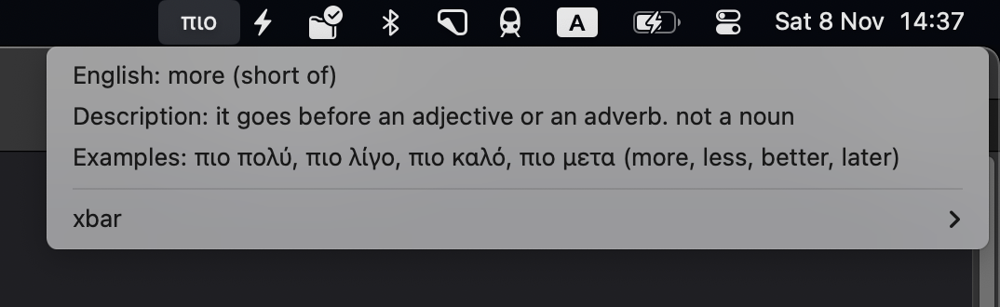

# greek menubar api

- Uses [opensheet](https://github.com/benborgers/opensheet) to turn a [google sheet](https://docs.google.com/spreadsheets/d/1x_BUYpryHseve8-NFiby2ZyVnlWYjcn9-0oPIYhQbPM/edit) into a json api
- Uses a single netlify function to fetch a random item from the api
- Uses [xbar](https://xbarapp.com/) to display a random greek menu item in the menubar

## random item endpoint

https://greek-menubar.netlify.app/.netlify/functions/api

